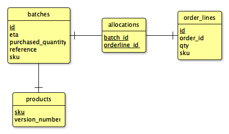

# Allocation

Example of implementing architecture patterns.

## Installation

## Usage

## Contribution

Requirements:

- Docker
- Java

Build with `make`. Other useful tasks: `make clean` and `make format`.

The end-to-end tests need a Postgres database. To skip end-to-end tests you can
set the environment variable `SKIP_TESTS=e2e`.

### Database Schema

## Credits

This project ported the Python source from a book to Java and Spring.

- [Source of Python Architecture Book](https://github.com/cosmicpython/code/)
